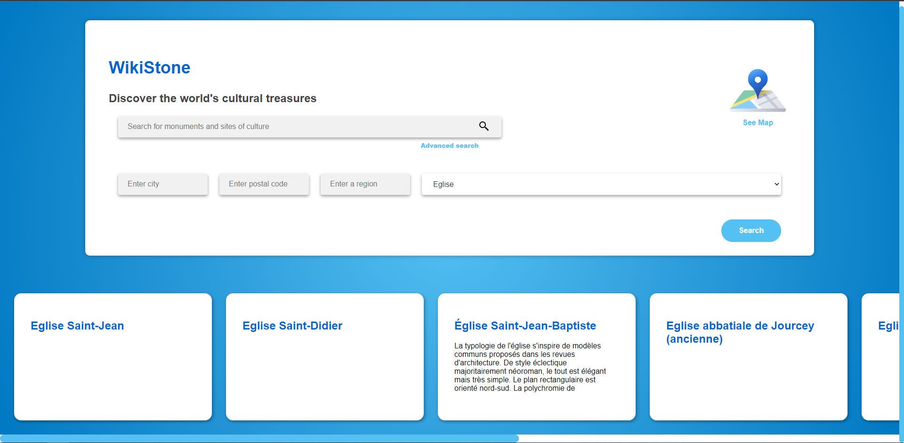
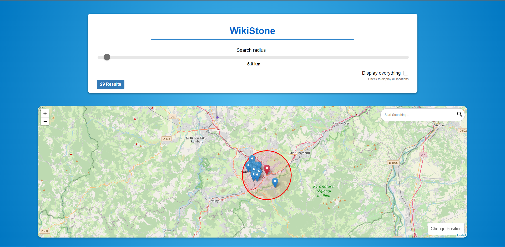
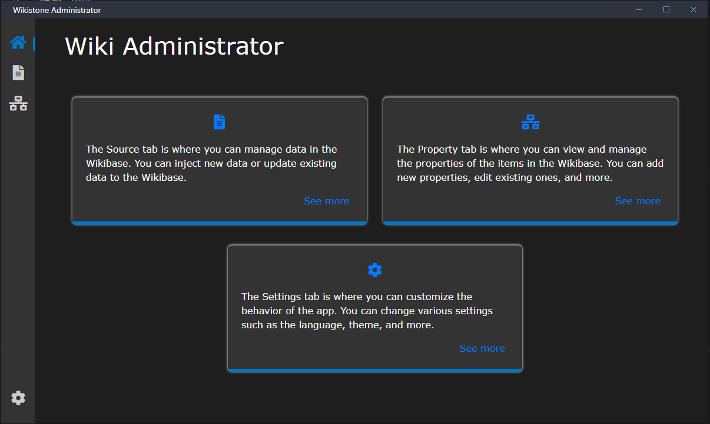
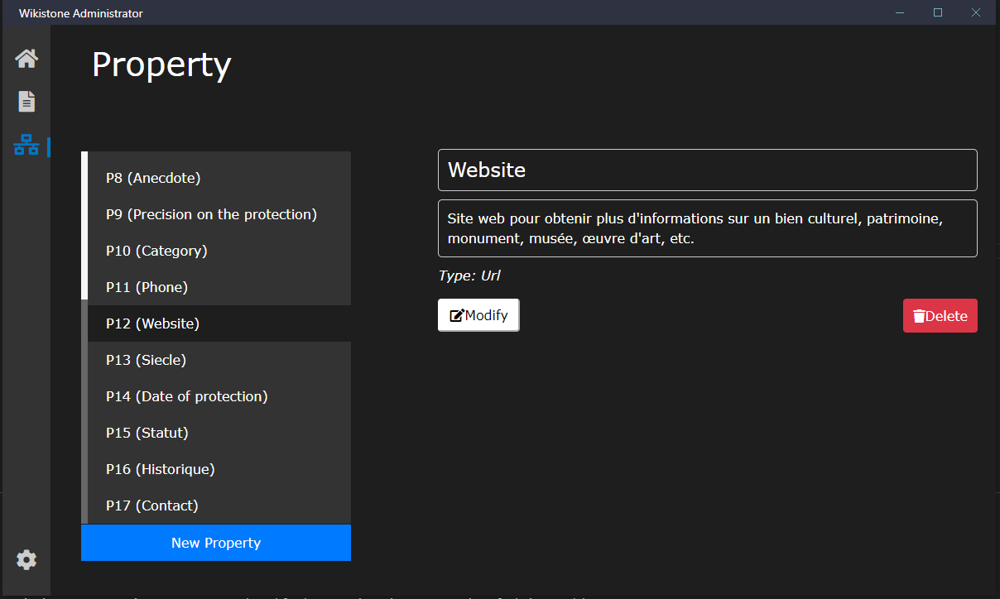
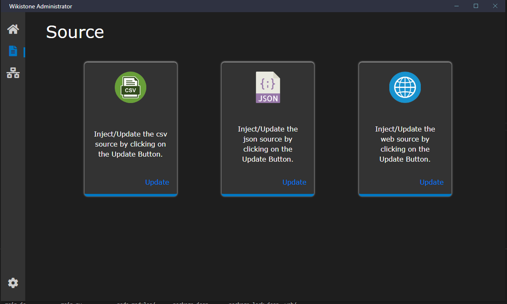

<p align="center">
  
</p>

Wikistone
=========

Wikistone est un projet permettant de centraliser les informations sur les monuments historiques, de les rendre accessibles et de les mettre à jour facilement.

## Comment fonctionne Wikistone ?

Wikistone est un projet qui utilise une base de connaissances (Knowledge Graph) pour stocker les informations sur les monuments historiques du département 42 (Loire). Cette base de connaissances est accessible via une API REST. Cette API est utilisée par une application web permettant de visualiser les informations sur les monuments historiques du département 42 (Loire).

La base en question est wikibase, une base de connaissances développée par la Wikimedia Foundation. Cette base de connaissances est utilisée par Wikipédia et Wikidata. (voir [wikibase](https://www.mediawiki.org/wiki/Wikibase) et [wikidata](https://www.wikidata.org/wiki/Wikidata:Main_Page))


## Documentation

La documentation du projet est disponible dans le dossier `documentation`. Ce dossier comprend la documentation suivante :

- [Dossier d’initialisation](./documentation/Dossier%20d%E2%80%99initialisation/Dossier_d_initialisation.pdf)
- [Description du modèle de données](./documentation/Description%20du%20mod%C3%A8le%20de%20donn%C3%A9es/Description_du_mod_le_de_donn_es.pdf)
- [Définition et description des sources d’information](./documentation/D%C3%A9finition%20et%20description%20des%20sources%20d%E2%80%99information/D_finition_et_description_des_sources_d_information.pdf)
- [Document de définition de l’application](./documentation/Document%20de%20d%C3%A9finition%20de%20l%E2%80%99application/Document_de_d_finition_de_l_application.pdf)
- [Document de conception](./documentation/Document%20de%20conception/Document_de_conception.pdf)
- [Suivi projet](./documentation/Suivi%20projet/Suivi_projet.pdf)
- [Planning](./documentation/planning/WikiStone%20-%20planning.xlsx)


## Présentation des applications

### Application web (wikistone)

L'application web permet de visualiser les informations sur les monuments historiques.
L'application présente une page d'accueil permettant de rechercher un monument historique par différents critères (nom, commune, type, etc...). Une fois le monument historique trouvé, l'utilisateur peut consulter les informations sur ce monument historique. 


L'interface présente également une carte intéractive permettant de visualiser les monuments historiques sur une carte. L'utilisateur peut alors cliquer sur un monument historique pour consulter les informations sur ce monument historique. Il peut également ce déplacer sur la carte pour visualiser les monuments historiques et estimer la distances entre sa position (ou la position de son choix) et les monuments historiques.



### Application d'administration (wikistone-admin)



L'application d'administration permet de gérer les informations sur les monuments historiques. Elle permet de créer, modifier et supprimer les propriétés des monuments historiques. 



Elle va faciliter la mise à jour des informations sur les monuments historiques et l'intégration de nouvelles données.



## Prérequis

Doivent être installés sur votre machine :

- [Docker](https://docs.docker.com/install/)
- [Docker-compose](https://docs.docker.com/compose/install/)
- [python3](https://www.python.org/downloads/)

## Installation

### Récupération du projet

```bash
git clone git@github.com:zestones/WikiStone.git
cd WikiStone
```

### Configuration

#### Création d'un BOT pour wikibase

```bash
cd wikibase
```
Ouvrez le fichier `config.json` et modifiez les informations de connexion de votre BOT :

```json
{
	"api_url": "http://localhost/w/api.php",
    "login_credentials": {
		"botUsername": "", // Nom d'utilisateur du BOT 
		"botPassword": "" // Mot de passe du BOT
	}
}
```

voir [wikibase bot](https://heardlibrary.github.io/digital-scholarship/host/wikidata/bot/) pour plus d'informations sur comment créer un BOT pour wikibase.

Il est possible de modifier directement ces informations dans le fichier ``python_wikibase.py`` dans le dossier ``wikibase > wikibase_request_api``.

Il vous suffit de modifier la configuration par defaut :

```js
DEFAULT_CONFIG = {
	"api_url": "http://localhost/w/api.php",
    "oauth_credentials": {},
    "login_credentials": {
		"botUsername": "", // Nom d'utilisateur du BOT
		"botPassword": "" // Mot de passe du BOT
	},
	"is_bot": True,
	"summary": "Modified using python-wikibase"
}
```

## Lancement

Un makefile est disponible pour lancer les différentes applications. Ce makefile se trouve dans le dossier `wikibase`.

Pour voir les différentes commandes disponibles, vous pouvez utiliser la commande suivante :

```bash
cd wikibase
make help
```

Voila les différentes commandes disponibles :

```bash
Usage: make <target>

Targets:
  install      install the dependencies
  wikistone    run the Flask app
  inject       run the wiki_injector script with options
  electron     run the electron app

  Options for inject:
   -- -h --help      show the help message
   -- -p --process   process all data sources
   -- -c --csv       process csv data source (https://dataclic.fr/)
   -- -a --api       process data from the api (https://data.culture.gouv.fr/api/)
   -- -s --scrap     process data from Web Scraping (https://www.loire.fr/)

  Options for electron:
   -- -a --app     run the desktop application
   -- -w --web     run the web application
```

### Lancement de wikibase

Avant de pouvoir lancer nos applications, il faut lancer wikibase à l'aide de docker :

```bash
docker-compose up -d
```

Vous aurez alors accès à wikibase à l'adresse suivante : [http://localhost](http://localhost)

### Lancement de l'application web

Une fois wikibase lancé, nous pouvons lancer l'application web :

```bash
cd wikibase
make wikistone
```

Vous aurez alors accès à l'application web à l'adresse suivante : [http://localhost:6060](http://localhost:6060)

Si c'est la première fois que vous lancez l'application, il faudra remplir la base de connaissances avec des données. voir [Remplir la base de connaissances](#remplir-la-base-de-connaissances)


### Lancement de l'application d'administration

Une fois wikibase lancé, nous pouvons lancer l'application d'administration :

```bash
cd wikibase
make electron -- -a 
```
ou 
```bash
cd wikibase
make electron -- --web
```
Cette application est disponible sous forme d'application lourde avec l'option ``-a`` ou sous forme d'application web avec l'option ``--web``.


Vous aurez alors accès à l'application d'administration à l'adresse suivante : [http://localhost:8000](http://localhost:8000)


### Lancement du script wiki_injector

Une fois wikibase lancé, nous pouvons lancer le script wiki_injector, ce script permet de remplir la base de connaissances avec des données :

Pour voir les différentes options disponibles, vous pouvez utiliser la commande suivante :
```bash
cd wikibase
make inject -- -h
```

Voila les différentes options disponibles :

```bash
Options for inject:
   -- -h --help      show the help message
   -- -p --process   process all data sources
   -- -c --csv       process csv data source (https://dataclic.fr/)
   -- -a --api       process data from the api (https://data.culture.gouv.fr/api/)
   -- -s --scrap     process data from Web Scraping (https://www.loire.fr/)
```

## Remplir la base de connaissances

Les données utilisées pour remplir la base de connaissances sont disponibles dans le dossier `data` pour les données statiques, pour les données dynamiques (données récupérées via une API ou du Web Scraping), elles ne sont pas stockées dans le projet mais directement injectées dans la base de connaissances lors du lancement de l'application de remplissage.

### Comment remplir la base de connaissances ?

Pour remplir la base de connaissances, vous avez deux possibilités :
 - Utiliser l'application d'administration
 - Utiliser le script `wiki_injector.py`

Si vous utilisez l'application d'administration, il vous suffit de lancer l'applications (voir [Lancement de l'application d'administration](#lancement-de-lapplication-dadministration)) et de vous rendre sur l'onglet `sources` puis de cliquer sur le bouton `Update/Import` d'une des sources de données disponibles.

Si vous utilisez le script `wiki_injector.py`, il vous suffit de lancer le script avec les options souhaitées (voir [Lancement du script wiki_injector](#lancement-du-script-wiki_injector)).